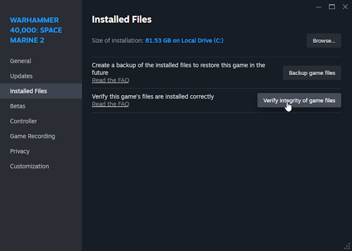

# Warhammer 40k Space Marine 2 - EAC Bypass guide
## Introduction
Usually, games that can be played offline can be started without AntiCheat and EasyAntiCheat supports this as well.    
It's up to the developers to add extra checks for whether EasyAntiCheat is running.
When Space Marine 2 starts, it checks if EAC is running and whether certain files were modified (hash comparison).    
If it finds modifications, it goes into **modded files** mode.  
Another check is for mods: if the game finds files in the *mods* directory, it goes into **mods detected** mode.
## Description
My EAC Bypass currently patches ONLY the **modded files** detection, which allows you to start the game without EAC and play Campaign or private PvE games without losing progress.  
During this time you can cheat as you like.  
## How to use
1. Download **SM2-EAC-Bypass_v(x.y.z).zip** archive from latest [release](https://github.com/igromanru/SM2-EAC-Bypass-Doc/releases).
2. Extract the archive somewhere and copy and replace **Warhammer 40000 Space Marine 2.exe** and **SM2-EAC-Patcher.exe** into the root directory of the game.  
   For Steam it's like: `C:\Program Files (x86)\Steam\steamapps\common\Space Marine 2\`  

   **Hint:** You can create a back-up copy of the original **Warhammer 40000 Space Marine 2.exe** first, but it's not needed.  
   **Hint 2:** You will have to replace the Launcher (Warhammer 40000 Space Marine 2.exe) after each game update.
3. Launch the game as always, from Steam or wherever you have it from. 
4. A MessageBox should appear. Select one:  
   **Yes** - Will start the game normally, with EAC and you will be able to play online  

   **No** - Will start the Patcher and the game without EAC

   **Cancel** - Will cancel the start

   
5. After choosing **No** to start without EAC, the launcher will run **SM2-EAC-Patcher.exe**, which requires Administrator privileges to patch the game at runtime.  
   Obviously, when the UAC prompt appears, you should press **Yes**.
6. Done. You can use Cheat Engine, [WeMod](https://www.wemod.com/cheats/warhammer-40000-space-marine-2-trainers) or whatever you want now, but don't try to join public games or PvP, you will be kicked out.  

## Troubleshooting
### What to do if the game detects "modded files" when starting with EAC
Right-click on the game in Steam, choose `Properties...`, open the `Installed Files` tab and execute **Verify integrity of the game files**.  
  

*If you're not on Steam, use google to find out how to verify the file integrity there.*  
Then, even while it's running, open `/(game directory)/EasyAntiCheat/` directory and delete the `Settings.bak`, if it exists.  
After the integrity check is done, reinstall the EAC Launcher and Patcher.